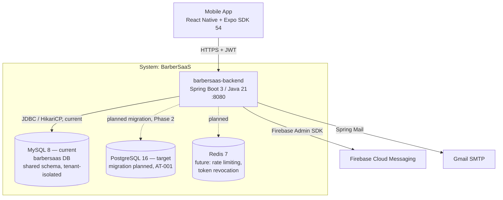

# System Architecture Overview — BarberSaaS

> Technical snapshot of the BarberSaaS platform: C4 diagrams, service catalog, and
> architectural principles. Derived from `PDR-BarberSaaS.md` (v2.0, August 2026).

---

## 1. Adopted architectural style

**Style:** Modular Monolith (single deployable unit, organized by DDD bounded contexts,
with explicit trigger-based extraction into microservices).

**Justification:** With a team of 1 developer and a load of tens of barbershops, the
operational overhead of a distributed system (service discovery, distributed tracing,
versioned contracts, network failures) would consume all available capacity without a
corresponding scalability need. A well-structured modular monolith can be extracted into
services faster than a poorly structured one, so bounded contexts are enforced as isolated
Java packages from day one, keeping the extraction path open without paying its cost early.

**Reference ADR:** [`ADR-002-modular-monolith.md`](decisions/records/ADR-002-modular-monolith.md)

---

## 2. C4 Diagram — System Level (Context)

```
┌───────────────────────────────────────────────────────────────────────┐
│                          System: BarberSaaS                           │
│                                                                        │
│                    ┌───────────────────────────────┐                  │
│                    │      barbersaas-backend        │                  │
│                    │   (Spring Boot 3 / Java 21)    │                  │
│                    │         Port: 8080             │                  │
│                    └───────────────┬─────────────────┘                  │
│                                    │                                    │
└────────────────────────────────────│────────────────────────────────────┘
                                     │ HTTPS (JWT)
                    ┌────────────────┼─────────────────┐
                    │                │                 │
           ┌────────▼──────┐ ┌───────▼───────┐ ┌───────▼────────┐
           │  Mobile App    │ │  Firebase FCM │ │  Gmail SMTP    │
           │ (React Native  │ │ (push notifs) │ │ (password      │
           │  + Expo)       │ │               │ │  recovery)     │
           │ Android / iOS  │ │               │ │                │
           └────────────────┘ └───────────────┘ └────────────────┘

External actors: Barbershop Owner (ADMIN_BARBERSHOP), Barber (BARBER),
Client (CLIENT), Platform Administrator (SUPER_ADMIN).
```

---

## 3. C4 Diagram — Container Level

**Mermaid diagram:**



> **Current vs. target database:** the diagram above shows both intentionally. The running
> system uses **MySQL 8** today (confirmed in `barbersaas-backend/docker-compose.yml` and
> `mysql-connector-j` in `pom.xml`). PostgreSQL 16 is the **Phase 2 migration target**
> (see AT-001 in Section 8 and `01-context/scope.md`), not yet deployed anywhere.

> Deployment: single JAR on Railway, automatic TLS, daily automated backups
> (30-day retention).

---

## 4. Service catalog

| # | Service | Responsibility | Port | DB | Communication type |
|---|---------|-----------------|------|----|--------------------|
| 1 | `barbersaas-backend` | All bounded contexts (auth, barbershop, employee, appointment, schedule, loyalty, finance, inventory, notification, plan, dashboard) | 8080 | **MySQL 8** currently (`mysql-connector-j` in `pom.xml`) — PostgreSQL 16 is the Phase 2 migration target (AT-001), not yet in use | REST (HTTPS), in-process calls between modules |

> BarberSaaS is currently a **single deployable service**. Internal modules
> (proto-microservices) are listed in the table below and act as the future service
> catalog once extraction triggers are met.

### 4.1 Internal modules (bounded contexts)

| Module | Package | Endpoint prefix | Bounded context |
|---|---|---|---|
| Auth | `com.barbersaas.auth` | `/api/auth/**` | Identity & Auth |
| Barbershop | `com.barbersaas.barbershop` | `/api/admin/barbershop`, `/api/super-admin/barbershops` | Barbershop Management |
| Employee | `com.barbersaas.employee` | `/api/admin/employees` | Barbershop Management |
| Appointment | `com.barbersaas.appointment` | `/api/client/appointments`, `/api/barber/appointments`, `/api/admin/appointments` | Appointment |
| Schedule | `com.barbersaas.schedule` | `/api/admin/schedules` | Schedule |
| Loyalty | `com.barbersaas.loyalty` | `/api/client/loyalty`, `/api/admin/loyalty` | Loyalty & Rewards |
| Finance | `com.barbersaas.finance` | `/api/admin/finance` | Finance & Inventory |
| Inventory | `com.barbersaas.inventory` | `/api/admin/inventory` | Finance & Inventory |
| Notification | `com.barbersaas.notification` | `/api/notifications` | Notifications |
| Plan | `com.barbersaas.plan` | `/api/super-admin/plans`, `/api/public/plans` | Platform Administration |
| Dashboard | `com.barbersaas.dashboard` | `/api/admin/dashboard`, `/api/super-admin/dashboard` | Supporting |

> Full detail per module → `09-microservices/service-catalog.md`

---

## 5. Architectural principles

### P1: Tenant Isolation by Design
Every table storing barbershop-scoped data carries a `barbershop_id` column. The
`TenantContext` (request-scoped, populated by `JwtAuthenticationFilter`) is validated in
every service method before any data access — no cross-tenant leak is possible through
the API layer.

### P2: Modular Monolith, Trigger-Based Extraction
Each bounded context is a self-contained Java package (its own controller, service, DTOs)
with no direct imports from other contexts except through domain entities and shared
security utilities. No service is extracted until a measured, documented trigger condition
is hit in production (see Section 6 and `10.3` of the PRD).

### P3: Fail Fast, Recover Gracefully
Validation happens at the edge (`@Valid` DTOs). Notifications are persisted to the
database **before** the FCM delivery attempt is made, so a push-notification failure never
blocks the primary operation.

### P4: Stateless Authentication
JWT (HS512), 24h expiry, 7-day refresh token. No server-side session, which allows
horizontal scaling behind a load balancer without session affinity.

### P5: API-First, Spanish-Localized UX
Endpoints are grouped by role prefix (`/api/public`, `/api/auth`, `/api/client`,
`/api/barber`, `/api/admin`, `/api/super-admin`). User-facing content (errors, emails,
notifications) is localized to Spanish (Colombia); code, comments, and internal
documentation are in English per `ADR-001`.

---

## 6. Adopted architectural patterns

| Pattern | Adopted | Reference |
|---------|---------|-----------|
| Modular Monolith (bounded contexts as packages) | Yes | `ADR-002-modular-monolith.md` |
| Database per Service | No — single shared PostgreSQL schema, tenant-isolated by `barbershop_id` (single deployable unit) | PRD §11.2 |
| Pessimistic Locking (anti-double-booking) | Yes — `PESSIMISTIC_WRITE` on appointment creation | PRD §7.2 (APPT-03), §8.1 |
| CQRS | No | — |
| Event Sourcing | No | — |
| Circuit Breaker | No (not required at current scale; FCM failures degrade gracefully by design, not via a breaker) | PRD §8.2 |
| Saga | No — inter-module calls are in-process, not distributed transactions | PRD §10.4 |
| Outbox Pattern | Partial — notifications are written to DB before external dispatch (FCM), same intent as an outbox, without a dedicated outbox table | PRD §7.6 (NOTIF-02) |
| Trigger-based service extraction | Yes | PRD §10.3 |

---

## 7. Cross-cutting concerns

| Concern | Adopted solution | Where it is configured |
|---------|------------------|--------------------------|
| Authentication / Authorization | JWT (HS512, 24h expiry) + Spring Security `@PreAuthorize` per endpoint | `com.barbersaas.auth`, `JwtAuthenticationFilter` |
| Tenant isolation | `barbershop_id` validated via `TenantContext` (ThreadLocal, cleared in `finally`) | Shared security module |
| Password storage | BCrypt (strength 10) | `com.barbersaas.auth` |
| Password recovery | 6-digit email code, 15-min expiry, single use | `com.barbersaas.auth`, Gmail SMTP |
| Push notifications | Firebase Admin SDK (FCM), DB-first write, graceful degradation on failure | `com.barbersaas.notification` |
| Transport security | HTTPS enforced (Railway auto-TLS) | Railway platform config |
| Secrets management | Environment variables only, never hardcoded | Railway env vars |
| Firebase credentials | `firebase-service-account.json` excluded via `.gitignore` | Repo `.gitignore` |
| Rate limiting | Planned for `/api/auth/**` before production (brute-force prevention) | Not yet implemented |
| API documentation | SpringDoc OpenAPI (Swagger) at `/swagger-ui.html` (dev profile) | `application.yml` |
| Error format | Standard JSON `{ "error": ..., "fields": {...} }` in Spanish | Shared exception handler |
| Timezone / locale | `America/Bogota` (UTC-5), `es-CO` currency formatting, DD/MM/YYYY | Shared config |

---

## 8. Registered architectural technical debt

| ID | Description | Impact | Priority | Target sprint |
|----|-------------|--------|---------|--------------|
| AT-001 | Development environment runs MySQL instead of PostgreSQL; migration required before first production deploy | High | P1 | Phase 2 (Q4 2026) |
| AT-002 | No rate limiting on `/api/auth/**` — brute-force exposure | Medium | P1 | Before production |
| AT-003 | No token revocation list for logout (Redis planned, not implemented) | Medium | P2 | Phase 2 |
| AT-004 | API is unversioned (no `/api/v1/` prefix) | Low | P3 | Before public API release |
| AT-005 | Walk-in client tracking and trial-expiration automation still in progress | Medium | P1 | Sprint 1 (in progress) |

> See also: `15-project-control/technical-backlog.md`

---

## 9. Planned evolution

| Version | Architectural change | Motivation | Estimated date |
|---------|------------------------|--------------|-------------------|
| Phase 2 | MySQL → PostgreSQL migration; production deploy on Railway | Production readiness, JSONB/MVCC benefits | Q4 2026 |
| Phase 2 (conditional) | Extract `notification-service` from `com.barbersaas.notification` | Trigger: FCM/email calls add >200ms to p95 appointment-creation latency, OR >5,000 active barbershops | Q4 2026 (trigger-based) |
| Phase 3 (conditional) | Extract `appointment-service` from `com.barbersaas.appointment` | Trigger: sustained CPU >70% at peak, or concurrent booking failures under load | Q1–Q2 2027 (trigger-based) |
| Phase 3 (conditional) | Extract `auth-service` from `com.barbersaas.auth` | Trigger: a second client application needs to authenticate against the same identity store | Q1–Q2 2027 (trigger-based) |
| Phase 4 (conditional) | Extract `loyalty-service` | Trigger: loyalty program sold as a standalone product outside the barbershop sector | Q3–Q4 2027 (trigger-based) |
| Phase 4 (conditional) | Extract `analytics-service` from `com.barbersaas.dashboard` | Trigger: dashboard queries exceed 2s, advanced reporting/data-warehouse needs | Q3–Q4 2027 (trigger-based) |

> All extractions are **trigger-based, not schedule-based** — no service is pulled out of
> the monolith until the trigger condition is measured in production (PRD §10.3).

---

## Key correlations

- Domain bounded contexts → `02-domain/domain-map.md`
- Architectural style decision → `ADR-002-modular-monolith.md`
- Documentation language decision → `ADR-001-idioma-documentacion.md`
- Hexagonal architecture per module (internal structure) → `05-architecture/hexagonal-architecture.md`
- Applied patterns catalog → `05-architecture/pattern-guide.md`
- Data model detail → `06-data/data-model.md`
- Per-module detail → `09-microservices/service-catalog.md`
- Source PRD → `PDR-BarberSaaS.md`
