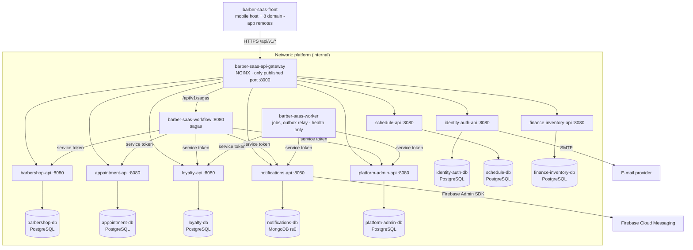

# System Architecture Overview — BarberSaaS

> Target architecture of the BarberSaaS platform: C4 diagrams, service catalog, and
> architectural principles. Source of truth for the topology is
> [ADR-004](decisions/records/ADR-004-full-microservice-decomposition.md); the rules it must
> satisfy come from the course norm 2026-B (sections 4, 5 and 7).

---

## 1. Adopted architectural style

**Style:** Microservices — one service and one database per business domain, behind a single
API gateway, with cross-domain processes orchestrated as sagas.

**Justification:** the course requires a full distributed-systems deliverable, and the team's
polyrepo under `code-corhuila` already provisions it: eight business domains, each split into
`-db`, `-api` and `-app`, plus five cross-cutting repositories (29 repositories). The
bounded contexts of `02-domain/domain-map.md` become the service boundaries unchanged.

**Reference ADRs:** [ADR-004](decisions/records/ADR-004-full-microservice-decomposition.md)
(topology), [ADR-005](decisions/records/ADR-005-language-per-service.md) (Java 21 / Spring
Boot 3.5), [ADR-006](decisions/records/ADR-006-database-engine-per-domain.md) (engine per
domain), [ADR-007](decisions/records/ADR-007-migration-tool-per-domain.md) (Liquibase),
[ADR-008](decisions/records/ADR-008-interface-framework.md) and
[ADR-009](decisions/records/ADR-009-saga-state-store.md) (proposed).

> **History.** The first-cut prototype (`code-corhuila/barber-saas`, category A) is a modular
> monolith on MySQL 8 with a single shared schema. That shape was recorded in ADR-002 and
> ADR-003, both **superseded by ADR-004**. The prototype is the source of the domain rules and
> entities being ported; it is not the target architecture, and nothing in this document
> describes it as current.

---

## 2. C4 Diagram — System Level (Context)

```
 Barbershop owner (ADMIN_BARBERSHOP) · Barber (BARBER) · Client (CLIENT) · Platform admin (SUPER_ADMIN)
                                            │
                                            ▼
                        ┌───────────────────────────────────────┐
                        │         Mobile app (barber-saas-front) │
                        │  host that loads each <domain>-app     │
                        └───────────────────┬───────────────────┘
                                            │ HTTPS + JWT (RS256)
                        ┌───────────────────▼───────────────────┐
                        │           System: BarberSaaS           │
                        │  api-gateway → 8 domain services,      │
                        │  workflow, worker, 8 databases         │
                        └─────────┬──────────────────┬──────────┘
                                  │                  │
                         ┌────────▼───────┐  ┌───────▼────────┐
                         │ Firebase FCM   │  │ SMTP (e-mail)  │
                         │ push messages  │  │ password reset │
                         └────────────────┘  └────────────────┘
```

---

## 3. C4 Diagram — Container Level


```mermaid
graph TB
  FRONT[barber-saas-front<br/>mobile host + 8 domain -app remotes]
  subgraph "Network: platform (internal)"
    GW[barber-saas-api-gateway<br/>NGINX · only published port :8000]
    AUTH[identity-auth-api :8080]
    SHOP[barbershop-api :8080]
    APPT[appointment-api :8080]
    SCHED[schedule-api :8080]
    LOY[loyalty-api :8080]
    NOTIF[notifications-api :8080]
    FIN[finance-inventory-api :8080]
    PADM[platform-admin-api :8080]
    WF[barber-saas-workflow :8080<br/>sagas]
    WK[barber-saas-worker<br/>jobs, outbox relay · health only]
    AUTHDB[(identity-auth-db<br/>PostgreSQL)]
    SHOPDB[(barbershop-db<br/>PostgreSQL)]
    APPTDB[(appointment-db<br/>PostgreSQL)]
    SCHEDDB[(schedule-db<br/>PostgreSQL)]
    LOYDB[(loyalty-db<br/>PostgreSQL)]
    NOTIFDB[(notifications-db<br/>MongoDB rs0)]
    FINDB[(finance-inventory-db<br/>PostgreSQL)]
    PADMDB[(platform-admin-db<br/>PostgreSQL)]
  end

  FRONT -->|HTTPS /api/v1/*| GW
  GW --> AUTH & SHOP & APPT & SCHED & LOY & NOTIF & FIN & PADM
  GW -->|/api/v1/sagas| WF
  AUTH --> AUTHDB
  SHOP --> SHOPDB
  APPT --> APPTDB
  SCHED --> SCHEDDB
  LOY --> LOYDB
  NOTIF --> NOTIFDB
  FIN --> FINDB
  PADM --> PADMDB
  WF -->|service token| APPT & LOY & NOTIF & PADM & SHOP
  WK -->|service token| NOTIF & PADM & LOY
  NOTIF -->|Firebase Admin SDK| FCM[Firebase Cloud Messaging]
  AUTH -->|SMTP| MAIL[E-mail provider]
```

- Every service listens on `8080` **inside** the `platform` network and declares `expose`,
  never `ports`. Only the gateway (and the observability stack) publishes a port to the host
  (norm 5.6.1, annex G).
- A service never reaches another domain's database (norm 7.3); it calls that domain's
  published API. Deployment detail: [`deployment.md`](deployment.md).

---

## 4. Service catalog

### 4.1 Domain services

| # | Domain | Repositories | Internal address | Database (ADR-006) | Gateway prefixes | Contract |
|---|---|---|---|---|---|---|
| 1 | Identity & Auth | `identity-auth-{db,api,app}` | `identity-auth-api:8080` | PostgreSQL | `/api/v1/auth` | `auth-service.yaml` |
| 2 | Barbershop | `barbershop-{db,api,app}` | `barbershop-api:8080` | PostgreSQL | `/api/v1/barbershops`, `/api/v1/services`, `/api/v1/barbers` | `barbershop-service.yaml` |
| 3 | Appointment (core) | `appointment-{db,api,app}` | `appointment-api:8080` | PostgreSQL | `/api/v1/appointments` | `appointment-service.yaml` |
| 4 | Schedule | `schedule-{db,api,app}` | `schedule-api:8080` | PostgreSQL | `/api/v1/barber-schedules`, `/api/v1/schedule-exceptions`, `/api/v1/availability` | `schedule-service.yaml` |
| 5 | Loyalty (core) | `loyalty-{db,api,app}` | `loyalty-api:8080` | PostgreSQL | `/api/v1/loyalty` | `loyalty-service.yaml` |
| 6 | Notifications | `notifications-{db,api,app}` | `notifications-api:8080` | MongoDB | `/api/v1/notifications`, `/api/v1/device-tokens` | `notification-service.yaml` |
| 7 | Finance & Inventory | `finance-inventory-{db,api,app}` | `finance-inventory-api:8080` | PostgreSQL | `/api/v1/finance`, `/api/v1/inventory` | `finance-inventory-service.yaml` |
| 8 | Platform Admin | `platform-admin-{db,api}` | `platform-admin-api:8080` | PostgreSQL | `/api/v1/plans`, `/api/v1/platform` | `platform-admin-service.yaml` |

All repositories carry the `barber-saas-` prefix. Contracts live in
`07-api/contracts/openapi/`; every path is served under `/api/v1` through the gateway.

### 4.2 Cross-cutting services

| Repository | Responsibility (norm 4.3) | Exposes |
|---|---|---|
| `barber-saas-api-gateway` | Single entry: routing (one routes file per domain), credential filter, rate limits, CORS, correlation | `:8000` to the host |
| `barber-saas-workflow` | Cross-domain sagas and their compensations | `/api/v1/sagas` via the gateway |
| `barber-saas-worker` | Scheduled jobs (reminders, trial expiration) and outbox relay | Health endpoint only |
| `barber-saas-infra` | Composes every repository, `platform` network, observability, development keys | Grafana to the host |
| `barber-saas-front` | Mobile host: one HTTP client, session and navigation for all `-app` remotes | The app itself |

---

## 5. Architectural principles

### P1: Database per service
Each domain owns one database, in its own instance and volume, versioned only in its `-db`
repository (norm 7.1–7.2). No foreign key crosses domains: a reference to another domain is a
UUID checked through that domain's contract (norm 7.4).

### P2: Tenant isolation in every service
The JWT carries the user's `barbershopId`. Every domain service derives the tenant from the
token — never from the request body — and filters every tenant-scoped query by it. The filter
that lived once in the prototype's `TenantContext` is now repeated in eight services, so it is
a review-gate item on every `-api` (ADR-004, risks).

### P3: Single entry, token validated everywhere
Clients only reach the gateway. The gateway checks that a credential is present; each service
validates it itself — RS256 with the identity service's public key, rejecting `none`/`HS256`,
requiring `exp` and `sub` (norm 5.3.7, 5.6.2). Internal calls from `workflow` and `worker` use
a service token issued by identity, never the user's token (norm 5.8.2).

### P4: Eventual consistency between domains
No distributed transaction spans two databases (norm 7.5). A service that changes its data and
must tell others writes the event to an outbox table in the same transaction (norm 5.3.11);
processes that must be undone on failure run as sagas in `-workflow`.

### P5: Hexagonal services
Each service is a Maven build with `-core` (no Spring dependency), `-adapters` and `-app`
(ADR-005). A framework annotation in the domain does not compile (norm 5.3.3).

### P6: English code, Spanish UX
Code, contracts and documentation are in English (ADR-001). User-facing text (messages,
e-mails, notifications) is Spanish (Colombia).

---

## 6. Adopted architectural patterns

| Pattern | Adopted | Reference |
|---|---|---|
| Database per Service | Yes — 8 instances: PostgreSQL ×7, MongoDB ×1 | ADR-006, norm 7.1 |
| API Gateway | Yes — NGINX, per-request resolution, one routes file per domain | Norm 5.6, annex F |
| Saga (orchestration) | Yes — in `-workflow`, state persisted after each step | Norm 5.8, ADR-009 (proposed) |
| Transactional Outbox | Yes — every service that publishes events | Norm 5.3.11 |
| Idempotent creation | Yes — `Idempotency-Key` on every creation | Norm 5.3.8, `07-api/guidelines.md` |
| Anti-double-booking lock | Yes — row lock inside `appointment-db` when creating an appointment | `02-domain/entities-and-rules.md` INV-APPT-001 |
| Bounded retries | Yes — exponential backoff with jitter, only for network/429/5xx | Norm 5.7.2 |
| Graceful degradation | Yes — a domain that is down answers `503` on its routes only | Norm 5.6.3 |
| CQRS / Event Sourcing | No | — |

---

## 7. Cross-cutting concerns

| Concern | Adopted solution | Where |
|---|---|---|
| Authentication | JWT RS256 issued by identity-auth; public key distributed to every service | `07-api/authentication.md`, norm 5.3.7 |
| Authorization | Roles `SUPER_ADMIN`, `ADMIN_BARBERSHOP`, `BARBER`, `CLIENT`, checked per endpoint | Each `-api` |
| Tenant isolation | `barbershopId` from the JWT, applied in every query | Each `-api` (P2) |
| Error format | `{error, message, details?, traceId}` — also for unknown routes and malformed JSON | `_shared.yaml` `ErrorResponse`, norm 5.3.5 |
| Correlation | `X-Correlation-Id` reused or generated, returned, logged, used as `traceId` | Gateway and each service, norm 5.3.9 |
| Identifiers / money / dates | UUID · integer minor units (`…Cents`) · RFC 3339 UTC | `07-api/guidelines.md` |
| Rate limiting and CORS | At the gateway; CORS only for the front's origins | `-api-gateway` |
| Password storage | BCrypt | identity-auth-api |
| Push notifications | Firebase Admin SDK from notifications-api; stored first, delivered after | notifications-api |
| Observability | Structured JSON logs, OpenTelemetry collector, Prometheus, Grafana | `-infra` |
| Secrets | `.env` per environment, never versioned; production keys from identity | `-infra`, norm 5.9.2 |
| Explicit limits | Server timeouts, pool size, statement timeout declared in each composition root | Norm 5.3.10 |

---

## 8. Registered architectural technical debt

| ID | Description | Impact | Priority |
|---|---|---|---|
| AT-001 | `06-data/models.md` still describes the prototype's single MySQL schema with BIGINT ids; it must be split per `-db` with UUID ids | High | P1 |
| AT-002 | `07-api/authentication.md` still describes HS512; the norm and this document require RS256 with a public key | High | P1 |
| AT-003 | Contracts use inconsistent `servers` and paths (`/appointments`, `localhost:8081`, `/api/notifications`) instead of `/api/v1` behind the gateway | Medium | P1 |
| AT-004 | Message transport for events (broker vs. worker-polled outbox) is not decided; needs its own ADR | Medium | P2 |
| AT-005 | ADR-008 (interface framework) and ADR-009 (saga store) await the teacher's answer | Medium | P2 |
| AT-006 | `09-microservices/service-catalog.md` still documents the prototype's modules | Medium | P2 |
| AT-007 | The 29 repositories hold only README and CODEOWNERS; no service is implemented yet | High | P1 |

---

## 9. Planned evolution

| Step | Architectural change | Motivation |
|---|---|---|
| 1 | Rewrite `06-data` per domain with UUID ids and cents (AT-001) | 07↔06 consistency |
| 2 | Align auth, contracts and servers to the norm (AT-002, AT-003) | 07↔05 consistency |
| 3 | Scaffold `-infra`, `-api-gateway` and the first vertical slice: identity-auth, barbershop, schedule, appointment | Appointment depends on barbershop and schedule |
| 4 | Loyalty, notifications and the booking saga in `-workflow` | Cross-domain flows |
| 5 | Finance & inventory, platform admin, worker jobs | Remaining domains |

---

## Key correlations

- Domain bounded contexts → `02-domain/domain-map.md`
- Topology decision → `decisions/records/ADR-004-full-microservice-decomposition.md`
- Superseded monolith decisions → `ADR-002-modular-monolith.md`, `ADR-003-academic-microservice-extraction.md`
- Deployment and environments → `05-architecture/deployment.md`, `10-devops/environments.md`
- Internal structure of each service → `05-architecture/hexagonal-architecture.md`
- Applied patterns catalog → `05-architecture/pattern-guide.md`
- Data model → `06-data/models.md`
- API contracts and conventions → `07-api/guidelines.md`, `07-api/contracts/openapi/`
