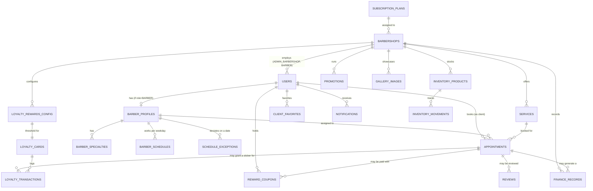

# Data Models — BarberSaaS

> Transcribed directly from the real, running schema:
> `barbersaas-backend/barbersaas-backend/db/init.sql`. Every table, column, type, constraint,
> and index below exists in that file — nothing here is proposed or aspirational. Where the
> schema differs from what `02-domain/entities-and-rules.md` describes (e.g., ID types), this
> document is the one that matches the database; `entities-and-rules.md` was already
> corrected to agree with it.

---

## Engine

**Current:** MySQL 8.x, `InnoDB`, `utf8mb4` / `utf8mb4_unicode_ci`. Single database
(`barbersaas`), single schema — **not** database-per-service. This matches the Modular
Monolith decision in ADR-002: one deployable unit, one shared schema, tenant isolation via
`barbershop_id` rather than physical separation.

**Target (Phase 2, not yet migrated):** PostgreSQL 16 — see AT-001 in
`05-architecture/overview.md`. The migration is expected to be close to 1:1 given standard
SQL types are used throughout (no MySQL-specific features beyond `ENUM` and `JSON`, both of
which have PostgreSQL equivalents — PostgreSQL's own `ENUM` type or a `CHECK` constraint, and
native `JSONB`).

**ID strategy:** every table uses `BIGINT AUTO_INCREMENT PRIMARY KEY` — **not** UUIDs. This
is a deliberate, verified fact (not a gap): see the "Not yet on this backlog" note on
sequential IDs in `04-requirements/functional.md` and the tenant-isolation discussion below.

---

## Entity-Relationship diagram



> This diagram covers foreign-key relationships only. `barbershop_id` also appears directly
> on most tables as the tenant discriminator (see "Tenant isolation" below) even where not
> drawn as its own arrow, to avoid a diagram with 15+ lines converging on one node.

---

## Tables by bounded context

Grouped per `02-domain/domain-map.md`'s bounded contexts, so this document and the domain
map stay easy to cross-reference.

### Platform Administration — `subscription_plans`

```sql
CREATE TABLE subscription_plans (
    id BIGINT AUTO_INCREMENT PRIMARY KEY,
    name VARCHAR(50) NOT NULL,
    price DECIMAL(10,2) NOT NULL,
    max_barbers INT NOT NULL,
    features_json JSON NULL,
    is_active BOOLEAN NOT NULL DEFAULT TRUE,
    created_at TIMESTAMP DEFAULT CURRENT_TIMESTAMP
) ENGINE=InnoDB;
```

**Real seed data (3 plans):**

| name | price (COP) | max_barbers |
|------|------------|--------------|
| Basico | 49,900.00 | 2 |
| Pro | 99,900.00 | 6 |
| Premium | 179,900.00 | 999 (effectively unlimited) |

> **Flagged inconsistency, not fixed here (out of this folder's scope):** these seeded plan
> names/prices (Basico/Pro/Premium at 49.9k/99.9k/179.9k) do **not** match the plan names and
> prices documented in `01-context/overview_en.md` → Monetization model (Starter/Profesional/
> Premium at 39.9k/79.9k/149.9k). One of the two is stale. Flagging for Daniel to confirm
> which is the current source of truth — did not overwrite either document to avoid guessing
> wrong.

---

### Barbershop Management — `barbershops`, `services`, `barber_profiles`, `barber_specialties`

```sql
CREATE TABLE barbershops (
    id BIGINT AUTO_INCREMENT PRIMARY KEY,
    name VARCHAR(120) NOT NULL,
    address VARCHAR(255),
    city VARCHAR(80) NOT NULL,
    latitude DECIMAL(10,7),
    longitude DECIMAL(10,7),
    phone VARCHAR(20),
    whatsapp_number VARCHAR(20),
    logo_url VARCHAR(255),
    status ENUM('ACTIVE','SUSPENDED','TRIAL','CANCELLED') NOT NULL DEFAULT 'TRIAL',
    plan_id BIGINT NULL REFERENCES subscription_plans(id),
    timezone VARCHAR(50) NOT NULL DEFAULT 'America/Bogota',
    cancellation_policy_hours INT NOT NULL DEFAULT 2,
    created_at TIMESTAMP DEFAULT CURRENT_TIMESTAMP,
    updated_at TIMESTAMP DEFAULT CURRENT_TIMESTAMP ON UPDATE CURRENT_TIMESTAMP
) ENGINE=InnoDB;
-- Indexes: city, status, (latitude, longitude)
```

> **Note:** `barbershops` has no `trial_ends_at` column, even though
> `02-domain/entities-and-rules.md` documents `trialEndsAt` as an entity attribute with its
> own invariant (INV-SHOP-001). Either it's computed in application code from `created_at +
> 60 days` rather than stored, or it's a genuine schema gap — worth confirming with whoever
> implemented FR-026 (trial expiration), since an automated expiration job needs a stored
> value to query against efficiently.

```sql
CREATE TABLE services (
    id BIGINT AUTO_INCREMENT PRIMARY KEY,
    barbershop_id BIGINT NOT NULL REFERENCES barbershops(id) ON DELETE CASCADE,
    name VARCHAR(100) NOT NULL,
    description VARCHAR(255),
    duration_minutes INT NOT NULL,
    price DECIMAL(10,2) NOT NULL,
    is_active BOOLEAN NOT NULL DEFAULT TRUE,
    created_at TIMESTAMP DEFAULT CURRENT_TIMESTAMP
) ENGINE=InnoDB;
-- Index: barbershop_id
```

```sql
CREATE TABLE barber_profiles (
    id BIGINT AUTO_INCREMENT PRIMARY KEY,
    user_id BIGINT NOT NULL UNIQUE REFERENCES users(id) ON DELETE CASCADE,
    barbershop_id BIGINT NOT NULL REFERENCES barbershops(id) ON DELETE CASCADE,
    experience_years INT DEFAULT 0,
    bio VARCHAR(500),
    rating_avg DECIMAL(3,2) DEFAULT 0.00,
    rating_count INT DEFAULT 0
) ENGINE=InnoDB;

CREATE TABLE barber_specialties (
    id BIGINT AUTO_INCREMENT PRIMARY KEY,
    barber_profile_id BIGINT NOT NULL REFERENCES barber_profiles(id) ON DELETE CASCADE,
    specialty_name VARCHAR(80) NOT NULL
) ENGINE=InnoDB;
```

> `barber_specialties` and `rating_avg`/`rating_count` on `barber_profiles` are real tables/
> columns **not mentioned anywhere in `02-domain/entities-and-rules.md`** — a genuine
> doc-vs-code gap on the domain side (out of scope to fix from here; flagging for a future
> `02-domain` pass). `rating_avg`/`rating_count` imply a review-aggregation mechanism that
> isn't documented as a business rule anywhere yet.

---

### Identity & Auth — `users`

```sql
CREATE TABLE users (
    id BIGINT AUTO_INCREMENT PRIMARY KEY,
    barbershop_id BIGINT NULL REFERENCES barbershops(id) ON DELETE CASCADE, -- NULL for SUPER_ADMIN and CLIENT
    full_name VARCHAR(120) NOT NULL,
    email VARCHAR(150) NOT NULL UNIQUE,
    password_hash VARCHAR(255) NOT NULL,
    phone VARCHAR(20),
    profile_photo_url VARCHAR(255),
    role ENUM('SUPER_ADMIN','ADMIN_BARBERSHOP','BARBER','CLIENT') NOT NULL,
    is_active BOOLEAN NOT NULL DEFAULT TRUE,
    created_at TIMESTAMP DEFAULT CURRENT_TIMESTAMP,
    updated_at TIMESTAMP DEFAULT CURRENT_TIMESTAMP ON UPDATE CURRENT_TIMESTAMP
) ENGINE=InnoDB;
-- Indexes: role, barbershop_id, email
```

> One `users` table for all 4 roles (not one table per role) — `barbershop_id` is the tenant
> FK, nullable exactly for the two roles that aren't barbershop-scoped (`SUPER_ADMIN`,
> `CLIENT`). This is the concrete implementation of the "User" entity described in
> `02-domain/domain-map.md`'s Identity & Auth context.

**Not in this schema:** `password_reset_tokens` and `device_tokens`, even though both are
referenced as real tables in `02-domain/entities-and-rules.md`'s "Deliberately excluded from
the domain model" note and confirmed to exist in code (`PasswordResetToken.java`,
`DeviceToken.java` entities). They are **not** in `init.sql` — likely because
`spring.jpa.hibernate.ddl-auto` auto-generates them from the JPA entity annotations rather
than through this manual script. If so, this script is not the complete schema source of
truth; treat it as accurate for the 21 tables it does define, and treat JPA entity classes as
the source of truth for anything not listed here.

---

### Schedule — `barber_schedules`, `schedule_exceptions`

```sql
CREATE TABLE barber_schedules (
    id BIGINT AUTO_INCREMENT PRIMARY KEY,
    barber_profile_id BIGINT NOT NULL REFERENCES barber_profiles(id) ON DELETE CASCADE,
    day_of_week TINYINT NOT NULL, -- 0=Sunday ... 6=Saturday
    start_time TIME NOT NULL,
    end_time TIME NOT NULL,
    is_active BOOLEAN NOT NULL DEFAULT TRUE,
    CONSTRAINT chk_schedule_time CHECK (end_time > start_time)
) ENGINE=InnoDB;
-- Index: (barber_profile_id, day_of_week)

CREATE TABLE schedule_exceptions (
    id BIGINT AUTO_INCREMENT PRIMARY KEY,
    barber_profile_id BIGINT NOT NULL REFERENCES barber_profiles(id) ON DELETE CASCADE,
    exception_date DATE NOT NULL,
    is_day_off BOOLEAN NOT NULL DEFAULT TRUE,
    start_time TIME NULL,
    end_time TIME NULL,
    reason VARCHAR(150)
) ENGINE=InnoDB;
-- Unique index: (barber_profile_id, exception_date) — one exception row per barber per date
```

The `CHECK (end_time > start_time)` constraint is the real, DB-level enforcement of the
"no zero/negative-length schedule slot" rule. The unique index on
`(barber_profile_id, exception_date)` is what makes AGGR-INV-BARBER-002
(`02-domain/entities-and-rules.md`: an exception overrides, never merges with, the weekly
schedule) actually enforceable — there can only be one exception row per barber per date.

---

### Appointment (Core Domain) — `appointments`

```sql
CREATE TABLE appointments (
    id BIGINT AUTO_INCREMENT PRIMARY KEY,
    barbershop_id BIGINT NOT NULL REFERENCES barbershops(id) ON DELETE CASCADE,
    client_id BIGINT NOT NULL REFERENCES users(id),
    barber_id BIGINT NOT NULL REFERENCES barber_profiles(id),
    service_id BIGINT NOT NULL REFERENCES services(id),
    appointment_date DATE NOT NULL,
    start_time TIME NOT NULL,
    end_time TIME NOT NULL,
    status ENUM('PENDING','CONFIRMED','IN_PROGRESS','COMPLETED','CANCELLED','NO_SHOW') NOT NULL DEFAULT 'PENDING',
    price_at_booking DECIMAL(10,2) NOT NULL,
    notes VARCHAR(500),
    cancelled_reason VARCHAR(255) NULL,
    created_at TIMESTAMP DEFAULT CURRENT_TIMESTAMP,
    updated_at TIMESTAMP DEFAULT CURRENT_TIMESTAMP ON UPDATE CURRENT_TIMESTAMP
) ENGINE=InnoDB;
-- Indexes: (barber_id, appointment_date, start_time), (barbershop_id, appointment_date),
--          client_id, status
```

> **Real discrepancy from `02-domain/entities-and-rules.md`:** the domain doc lists
> `clientId` as "Yes (nullable for walk-ins)" to support walk-in clients without an account.
> The real column is `client_id BIGINT NOT NULL` — **not nullable**. Since walk-in tracking
> is itself documented as "in progress" (`01-context/scope.md`, feature F-13), this schema
> constraint is likely the actual current blocker: walk-ins can't be persisted without first
> either making this column nullable or creating a placeholder `CLIENT` user record per
> walk-in. Worth surfacing to whoever picks up F-13.

The `(barber_id, appointment_date, start_time)` index is what makes the anti-double-booking
pessimistic lock (INV-APPT-001) fast — it's the exact lookup pattern
`AppointmentService.create()` uses to find conflicting bookings before locking.

---

### Loyalty & Rewards — `loyalty_rewards_config`, `loyalty_cards`, `loyalty_transactions`, `reward_coupons`

```sql
CREATE TABLE loyalty_rewards_config (
    id BIGINT AUTO_INCREMENT PRIMARY KEY,
    barbershop_id BIGINT NOT NULL REFERENCES barbershops(id) ON DELETE CASCADE,
    stickers_required INT NOT NULL DEFAULT 10,
    reward_description VARCHAR(255) NOT NULL,
    is_active BOOLEAN NOT NULL DEFAULT TRUE
) ENGINE=InnoDB;

CREATE TABLE loyalty_cards (
    id BIGINT AUTO_INCREMENT PRIMARY KEY,
    client_id BIGINT NOT NULL REFERENCES users(id) ON DELETE CASCADE,
    barbershop_id BIGINT NOT NULL REFERENCES barbershops(id) ON DELETE CASCADE,
    stickers_count INT NOT NULL DEFAULT 0,
    total_rewards_redeemed INT NOT NULL DEFAULT 0,
    last_updated TIMESTAMP DEFAULT CURRENT_TIMESTAMP ON UPDATE CURRENT_TIMESTAMP,
    UNIQUE KEY uq_client_barbershop (client_id, barbershop_id)
) ENGINE=InnoDB;

CREATE TABLE loyalty_transactions (
    id BIGINT AUTO_INCREMENT PRIMARY KEY,
    loyalty_card_id BIGINT NOT NULL REFERENCES loyalty_cards(id) ON DELETE CASCADE,
    appointment_id BIGINT NULL REFERENCES appointments(id),
    type ENUM('STICKER_EARNED','REWARD_REDEEMED') NOT NULL,
    granted_by_user_id BIGINT NOT NULL REFERENCES users(id),
    created_at TIMESTAMP DEFAULT CURRENT_TIMESTAMP
) ENGINE=InnoDB;

CREATE TABLE reward_coupons (
    id BIGINT AUTO_INCREMENT PRIMARY KEY,
    client_id BIGINT NOT NULL REFERENCES users(id) ON DELETE CASCADE,
    barbershop_id BIGINT NOT NULL REFERENCES barbershops(id) ON DELETE CASCADE,
    status ENUM('ACTIVE', 'USED') NOT NULL DEFAULT 'ACTIVE',
    appointment_id BIGINT NULL REFERENCES appointments(id) ON DELETE SET NULL,
    created_at TIMESTAMP DEFAULT CURRENT_TIMESTAMP,
    used_at TIMESTAMP NULL
);
-- Index: (client_id, barbershop_id, status) — the exact lookup for "does this client have an active coupon here?"
```

`loyalty_transactions` is the one real append-only event log in the system — see
`02-domain/domain-events.md`'s `StickerGranted`/`RewardRedeemed` events, which map directly
to a row here. The `uq_client_barbershop` unique key on `loyalty_cards` is the DB-level
guarantee behind "a client has one card per barbershop."

---

### Finance & Inventory — `finance_records`, `inventory_products`, `inventory_movements`

```sql
CREATE TABLE finance_records (
    id BIGINT AUTO_INCREMENT PRIMARY KEY,
    barbershop_id BIGINT NOT NULL REFERENCES barbershops(id) ON DELETE CASCADE,
    type ENUM('INCOME','EXPENSE') NOT NULL,
    category VARCHAR(80) NOT NULL,
    amount DECIMAL(10,2) NOT NULL,
    description VARCHAR(255),
    record_date DATE NOT NULL,
    related_appointment_id BIGINT NULL REFERENCES appointments(id),
    created_at TIMESTAMP DEFAULT CURRENT_TIMESTAMP
) ENGINE=InnoDB;
-- Indexes: (barbershop_id, record_date), type
```

> **Note:** the schema has no `CHECK (amount > 0)` constraint — the "amount must be positive"
> rule (`02-domain/entities-and-rules.md`, FR-017 in `04-requirements/functional.md`) is
> enforced only in application code (`@Valid` / service-layer validation), not at the
> database level. A direct SQL insert (or a future bug bypassing validation) could still
> write a zero/negative amount. Worth a `CHECK` constraint in a future migration.

```sql
CREATE TABLE inventory_products (
    id BIGINT AUTO_INCREMENT PRIMARY KEY,
    barbershop_id BIGINT NOT NULL REFERENCES barbershops(id) ON DELETE CASCADE,
    name VARCHAR(120) NOT NULL,
    description VARCHAR(255),
    unit VARCHAR(20) NOT NULL DEFAULT 'unidad',
    current_stock DECIMAL(10,2) NOT NULL DEFAULT 0,
    min_stock_alert DECIMAL(10,2) NOT NULL DEFAULT 0,
    created_at TIMESTAMP DEFAULT CURRENT_TIMESTAMP
) ENGINE=InnoDB;

CREATE TABLE inventory_movements (
    id BIGINT AUTO_INCREMENT PRIMARY KEY,
    product_id BIGINT NOT NULL REFERENCES inventory_products(id) ON DELETE CASCADE,
    movement_type ENUM('IN','OUT') NOT NULL,
    quantity DECIMAL(10,2) NOT NULL,
    reason VARCHAR(255),
    created_by_user_id BIGINT NOT NULL REFERENCES users(id),
    created_at TIMESTAMP DEFAULT CURRENT_TIMESTAMP
) ENGINE=InnoDB;
-- Index: (product_id, created_at)
```

`current_stock` and `min_stock_alert` are `DECIMAL(10,2)`, not integers — stock is tracked
fractionally (e.g., `2000.00 ml` of shampoo, per the real seed data), not just as whole-unit
counts. The "stock alert" logic (`current_stock <= min_stock_alert`) is computed in
application code on read, not as a stored/generated column.

---

### Notifications — `notifications`

```sql
CREATE TABLE notifications (
    id BIGINT AUTO_INCREMENT PRIMARY KEY,
    user_id BIGINT NOT NULL REFERENCES users(id) ON DELETE CASCADE,
    title VARCHAR(150) NOT NULL,
    body VARCHAR(500) NOT NULL,
    type ENUM('APPOINTMENT_CONFIRMATION','REMINDER','PROMOTION','SYSTEM') NOT NULL,
    is_read BOOLEAN NOT NULL DEFAULT FALSE,
    created_at TIMESTAMP DEFAULT CURRENT_TIMESTAMP
) ENGINE=InnoDB;
-- Index: (user_id, is_read)
```

The `type` enum has exactly 4 values — matches `Notification.Type` in the Java entity
exactly (verified in `com.barbersaas.domain.entity.Notification`). Note there is no distinct
type for "appointment cancelled" — per `02-domain/domain-events.md`, that notification is
actually sent with `type = SYSTEM`, not a dedicated cancellation type. `PROMOTION` exists in
the enum but nothing in the reviewed code path currently creates a `PROMOTION` notification —
likely reserved for the `promotions` table below, not yet wired up.

---

### Not yet mapped to a bounded context in `domain-map.md`

These three tables are real and implemented, but aren't mentioned in
`02-domain/domain-map.md`'s bounded-context list at all — a gap on the domain-modeling side,
not something to invent a bounded context for here.

```sql
CREATE TABLE reviews (
    id BIGINT AUTO_INCREMENT PRIMARY KEY,
    client_id BIGINT NOT NULL REFERENCES users(id),
    barbershop_id BIGINT NOT NULL REFERENCES barbershops(id) ON DELETE CASCADE,
    barber_profile_id BIGINT NULL REFERENCES barber_profiles(id),
    appointment_id BIGINT NULL REFERENCES appointments(id),
    rating TINYINT NOT NULL CHECK (rating BETWEEN 1 AND 5),
    comment VARCHAR(500),
    created_at TIMESTAMP DEFAULT CURRENT_TIMESTAMP
) ENGINE=InnoDB;
-- Indexes: barbershop_id, barber_profile_id

CREATE TABLE promotions (
    id BIGINT AUTO_INCREMENT PRIMARY KEY,
    barbershop_id BIGINT NOT NULL REFERENCES barbershops(id) ON DELETE CASCADE,
    title VARCHAR(120) NOT NULL,
    description VARCHAR(255),
    discount_type ENUM('PERCENTAGE','FIXED_AMOUNT','TWO_FOR_ONE') NOT NULL,
    discount_value DECIMAL(10,2) NOT NULL,
    valid_from DATE NOT NULL,
    valid_to DATE NOT NULL,
    is_active BOOLEAN NOT NULL DEFAULT TRUE
) ENGINE=InnoDB;
-- Index: (barbershop_id, is_active)

CREATE TABLE client_favorites (
    id BIGINT AUTO_INCREMENT PRIMARY KEY,
    client_id BIGINT NOT NULL REFERENCES users(id) ON DELETE CASCADE,
    barbershop_id BIGINT NOT NULL REFERENCES barbershops(id) ON DELETE CASCADE,
    created_at TIMESTAMP DEFAULT CURRENT_TIMESTAMP,
    UNIQUE KEY uq_client_favorite (client_id, barbershop_id)
) ENGINE=InnoDB;

CREATE TABLE gallery_images (
    id BIGINT AUTO_INCREMENT PRIMARY KEY,
    barbershop_id BIGINT NOT NULL REFERENCES barbershops(id) ON DELETE CASCADE,
    barber_profile_id BIGINT NULL REFERENCES barber_profiles(id),
    image_url VARCHAR(255) NOT NULL,
    caption VARCHAR(255),
    created_at TIMESTAMP DEFAULT CURRENT_TIMESTAMP
) ENGINE=InnoDB;
```

None of `reviews`, `promotions`, `client_favorites`, or `gallery_images` appear in
`01-context/scope.md`'s MVP feature list either — they exist and work in the database and
(per the matching `favorite`, `review`, `gallery` Java packages) in the backend, but are
undocumented product features. Worth a `docs-code-sync` pass to decide whether to formalize
them as in-scope features or explicitly mark them as unscoped/experimental.

---

## Tenant isolation (cross-cutting)

Every table above except `subscription_plans`, `users` (nullable), and the join/audit
tables that hang off an already-tenant-scoped parent carries `barbershop_id` directly. There
is no row-level security or schema-level enforcement in MySQL for this — isolation is
entirely an application-layer guarantee via `TenantContext`
(`00-governance/security-policy.md`). A raw SQL query without a `WHERE barbershop_id = ?`
clause would silently return cross-tenant data; nothing in the schema itself prevents that.

---

## Standard audit fields — what this schema actually uses

Unlike the generic pattern this document used to describe (UUID PKs, `deleted_at` soft
delete, `created_by`/`updated_by` on every table), the real schema is simpler:

| Field | Present on | Notes |
|-------|-----------|-------|
| `created_at` | Almost every table | `TIMESTAMP DEFAULT CURRENT_TIMESTAMP` |
| `updated_at` | Only tables with mutable state after creation (`barbershops`, `users`, `appointments`, `loyalty_cards`) | `ON UPDATE CURRENT_TIMESTAMP` |
| `deleted_at` / soft delete | **None** — not used anywhere in this schema | Deletes are either hard `ON DELETE CASCADE` (tenant cleanup) or represented as a status change (e.g., `is_active = FALSE`, `status = 'CANCELLED'`), not a soft-delete timestamp |
| `created_by` / `updated_by` | **None** as generic columns | Where "who did this" matters, it's a specific named FK instead (`granted_by_user_id`, `created_by_user_id`) — more precise than a generic audit column |

---

## Correlations

- Domain entities and invariants these tables encode → `02-domain/entities-and-rules.md`
- Bounded contexts these tables group into → `02-domain/domain-map.md`
- Field-level meaning of ambiguous columns → `06-data/data-dictionary.md`
- Current-vs-target DB engine decision → `05-architecture/overview.md` (AT-001)
- Source file → `barbersaas-backend/barbersaas-backend/db/init.sql`
