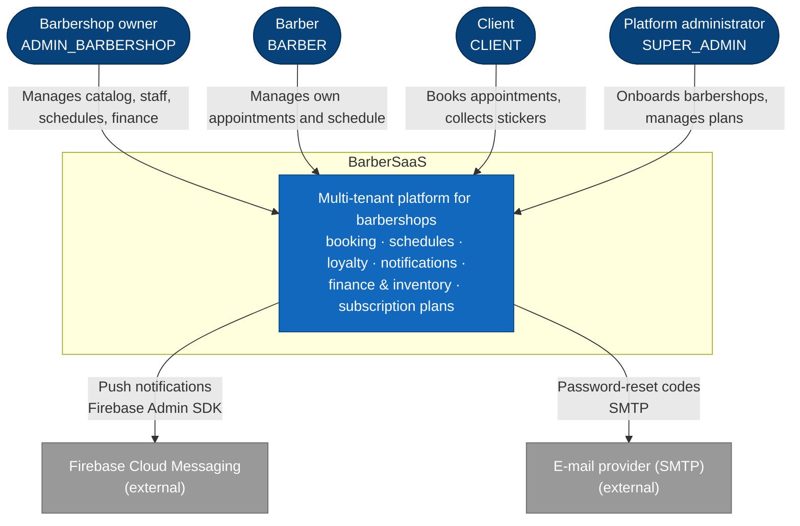

# C4-01 · System Context

> **Level:** C4 L1 · **Derived from:** `05-architecture/overview.md` §2, `07-api/authentication.md`
> (roles) · **Decision:** ADR-004

BarberSaaS as a single box: who uses it and which external systems it depends on.

| Element | Notes |
|---|---|
| Users | Exactly four roles, one per user (`identity_auth.app_user.role`). Every role uses the mobile app |
| Firebase Cloud Messaging | Called only by `notifications-api`; a delivery failure never blocks the operation that produced the notification |
| E-mail provider | Called only by `identity-auth-api` for the 6-digit password-reset code (15 min, single use) |

Next level: [C4-02 · Containers](c2-containers.md).
