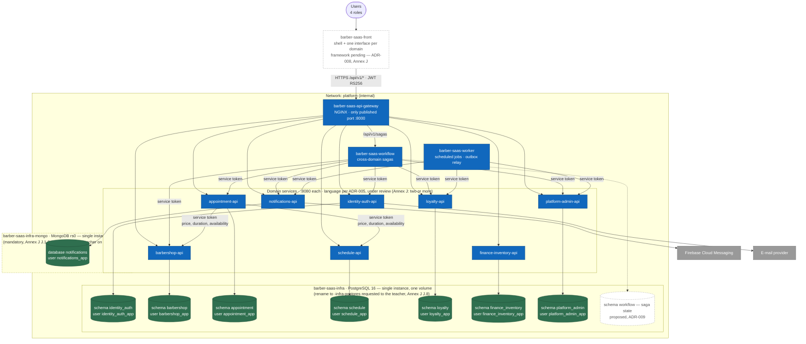

# C4-02 · Containers

> **Level:** C4 L2 · **Derived from:** `05-architecture/overview.md` §3–4,
> `05-architecture/deployment.md`, course norm **Annex J** (2026-10-01) · **Decisions:** ADR-004
> (topology), ADR-006 (engine per domain), ADR-009 (saga store, proposed)

The deployable units of the 29 repositories: one front, one gateway, eight domain services, the
workflow and the worker, and **one database instance per engine**. Annex J replaces norm 7.1:
there is a single PostgreSQL instance and a single MongoDB instance, each with its own volume,
defined in the infrastructure repositories; every domain lives in **its own schema** (its own
database in MongoDB) and every service connects with its own user, `<domain>_app`.

Each schema is migrated **only** by its own `barber-saas-<domain>-db` repository, which ships
nothing but its migrations and a runner with its own changelog table
(`databasechangelog_<domain>`). The instance, its volume, the extensions and the `<domain>_app`
users belong to the infrastructure repository, with one variables file per environment
(`env/dev.env`, `env/qa.env`, `env/main.env`) (Annex J J.5–J.7).

## Rules the diagram encodes

| Rule | Where it shows | Source |
|---|---|---|
| One instance per engine; one schema per domain; each service connects as `<domain>_app`, never as the administrator | Two instances; every `-api` has exactly one arrow, to its own schema | Annex J J.2–J.4, J.7 |
| A domain writes only to its own schema; reading another domain needs the owner's `GRANT` and a technical-debt ADR (none exists today) | No arrow from an `-api` to another domain's schema | Annex J J.3.2–J.3.3 |
| No foreign key between schemas; one transaction writes to one domain | Cross-domain data travels through the arrows between services | Annex J J.3.4–J.3.5, norm 7.4–7.5 |
| Single entry point | Only the gateway is reached from outside the `platform` network | Norm 5.6.1, annex F |
| Internal calls carry a service token, never the user's token | Arrows from `workflow`, `worker` and `appointment-api` | `07-api/authentication.md`, norm 5.8.2 |
| No distributed transaction | Cross-domain effects go through outbox events or sagas | Norm 7.5, 5.3.11 |

## Not drawn

- **Event transport** between the outbox tables and their consumers is undecided (AT-004 in
  `05-architecture/overview.md`); the flows in `uml/seq-complete-appointment.md` show it as a
  relay.
- **Saga state store** is dashed because ADR-009 is still *Proposed*.
- Observability (OpenTelemetry collector, Prometheus, Grafana) lives in `barber-saas-infra`;
  see `05-architecture/deployment.md`.
- **The interface framework** is dashed because ADR-008 is still *Proposed*, and Annex J asks
  for one portal per domain in React and Angular (divergence D-7 in the index).
- **`barber-saas-infra-mongo`** is dashed because the repository does not exist yet; the teacher
  creates it on request (Annex J J.8.3).
- Where this diagram and ADR-005, ADR-006 or `deployment.md` disagree, Annex J rules; the
  documents still to be aligned are listed as D-5…D-8 in [`diagram-index.md`](../diagram-index.md).

Next level: [C4-03 · appointment-api components](c3-appointment-api.md).
