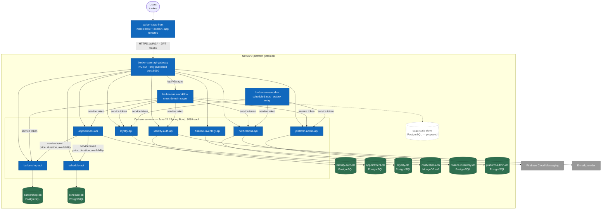

# C4-02 · Containers

> **Level:** C4 L2 · **Derived from:** `05-architecture/overview.md` §3–4,
> `05-architecture/deployment.md` · **Decisions:** ADR-004 (topology), ADR-006 (engine per
> domain), ADR-009 (saga store, proposed)

The deployable units of the 29 repositories: one front, one gateway, eight domain services with
eight databases, the workflow and the worker.

## Rules the diagram encodes

| Rule | Where it shows | Source |
|---|---|---|
| One database per domain; nobody reads another domain's database | Each `-api` has exactly one arrow to a database | Norm 7.1–7.3, ADR-004 |
| Single entry point | Only the gateway is reached from outside the `platform` network | Norm 5.6.1, annex F |
| Internal calls carry a service token, never the user's token | Arrows from `workflow`, `worker` and `appointment-api` | `07-api/authentication.md`, norm 5.8.2 |
| No distributed transaction | Cross-domain effects go through outbox events or sagas | Norm 7.5, 5.3.11 |

## Not drawn

- **Event transport** between the outbox tables and their consumers is undecided (AT-004 in
  `05-architecture/overview.md`); the flows in `uml/seq-complete-appointment.md` show it as a
  relay.
- **Saga state store** is dashed because ADR-009 is still *Proposed*.
- Observability (OpenTelemetry collector, Prometheus, Grafana) lives in `barber-saas-infra`;
  see `05-architecture/deployment.md`.

Next level: [C4-03 · appointment-api components](c3-appointment-api.md).
