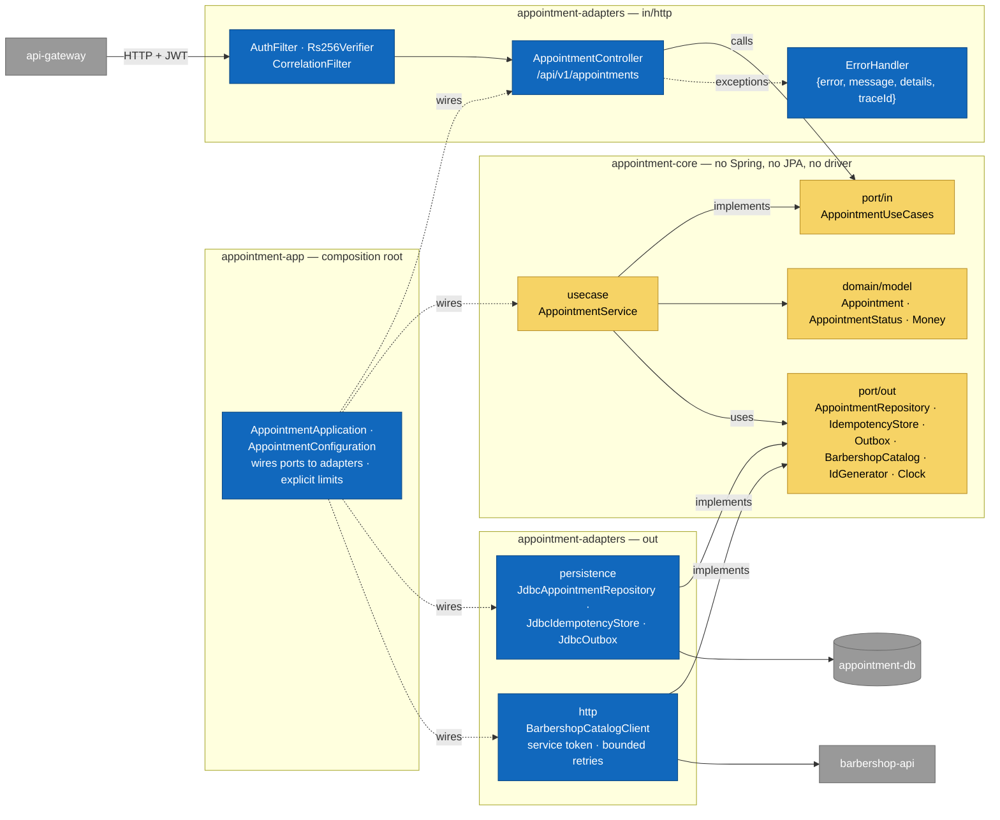

# C4-03 · appointment-api Components

> **Level:** C4 L3 · **Derived from:** `05-architecture/hexagonal-architecture.md` (folder
> structure of `barber-saas-appointment-api`) · **Rule:** norm 5.3.2 (seven layers), 5.3.3

The inside of one domain service. Appointment is drawn because it is the core domain; every
other `-api` has the same shape with its own ports.

## Reading it

| Layer (norm 5.3.2) | Component | Depends on |
|---|---|---|
| Domain | `Appointment` aggregate (state machine, INV-APPT-001…005), `Money` in cents | Nothing |
| Port in | `AppointmentUseCases` — book, confirm, start, complete, cancel, noShow, list | Domain |
| Port out | Repository, idempotency store, outbox, barbershop catalog, id generator, clock | Domain |
| Use case | `AppointmentService` orchestrates; the aggregate decides | Ports |
| Adapter in | Controller + filters; reads the tenant from the token, never from the body | Port in |
| Adapter out | JDBC adapters (one transaction for row + idempotency key + outbox event), HTTP client | Port out |
| Composition root | The only place that knows concrete classes | Everything |

Arrows only point inward: `appointment-core` compiles without Spring (norm 5.3.3). The
lifecycle the aggregate enforces is [ST-01](../uml/state-appointment.md).
