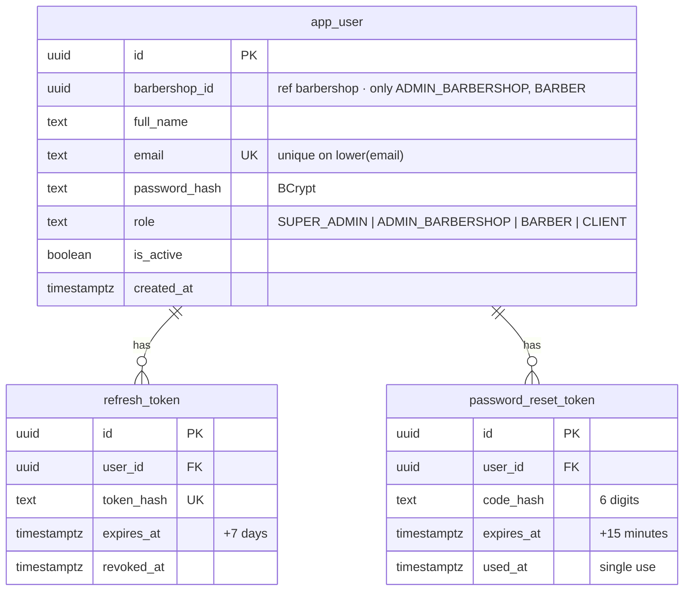
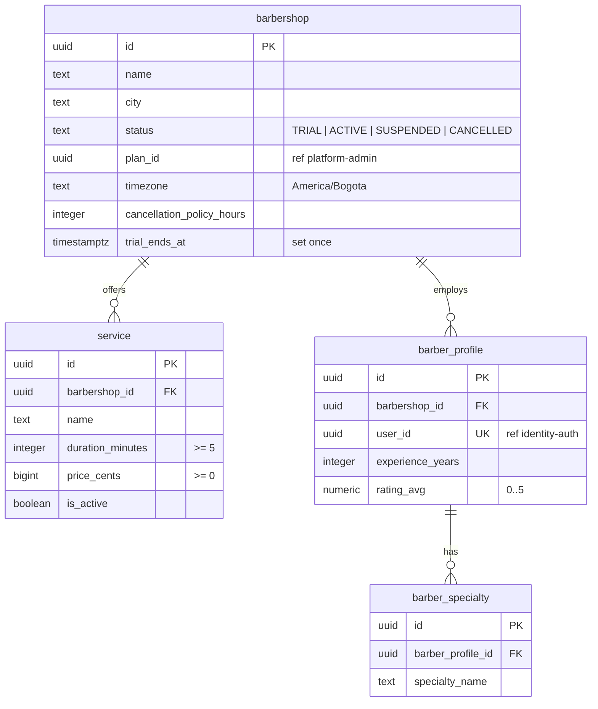
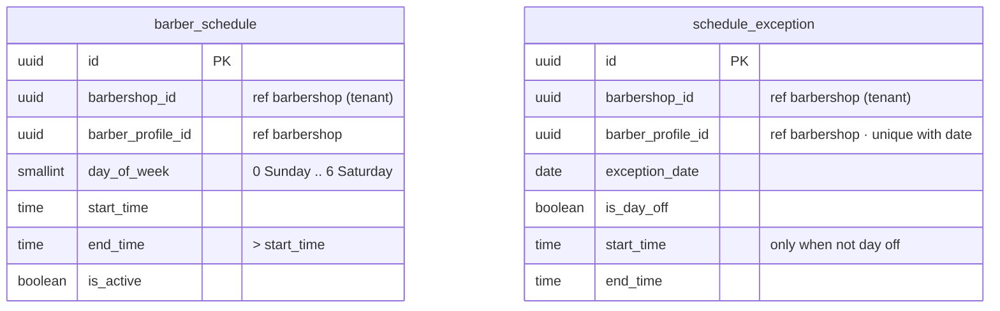
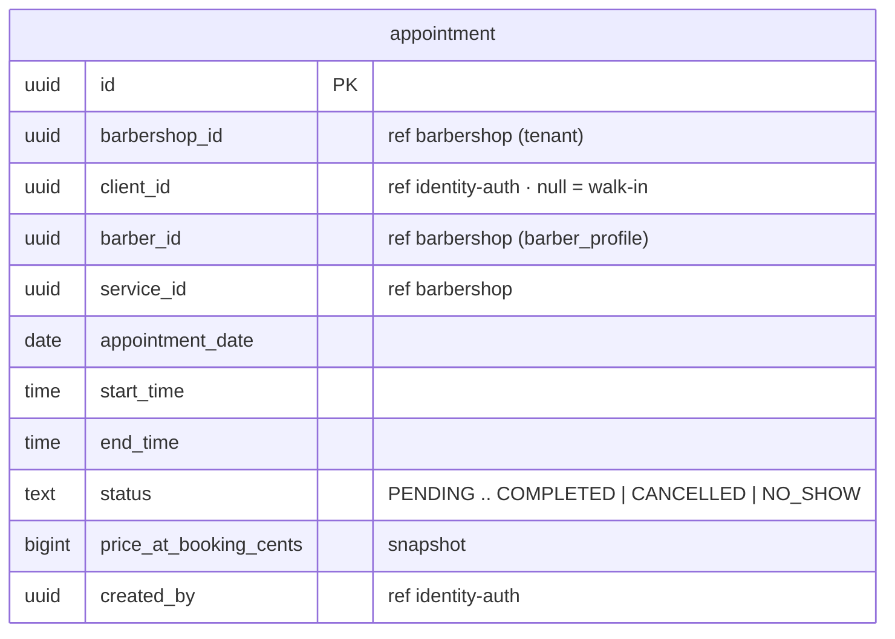
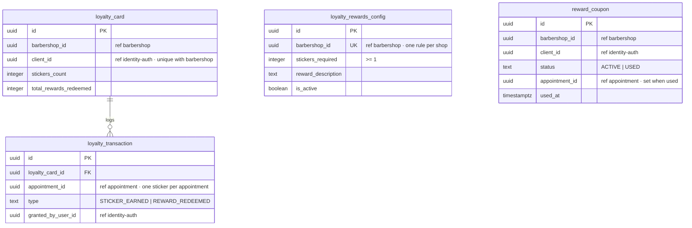
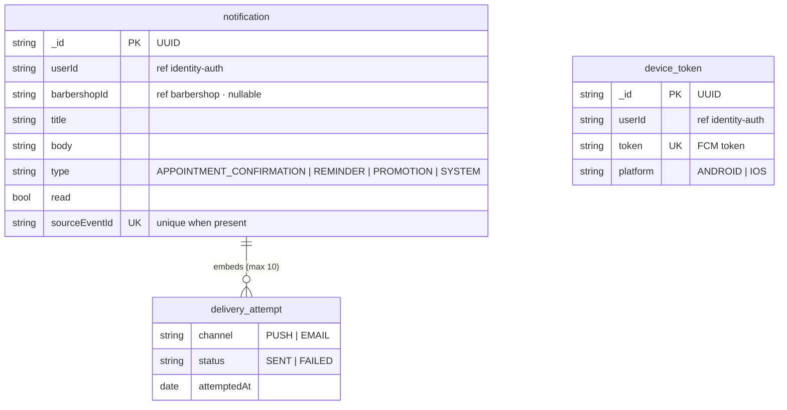
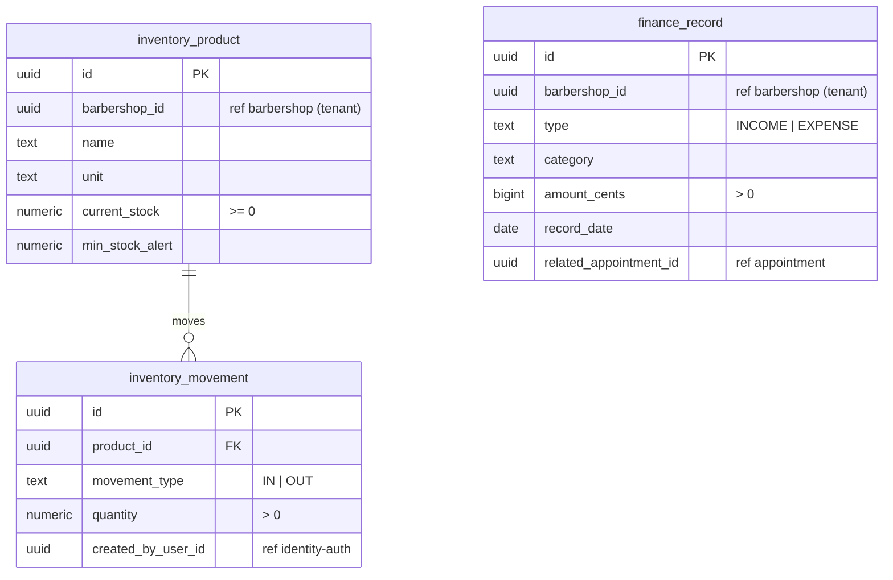
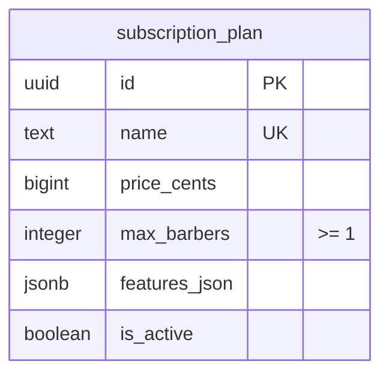
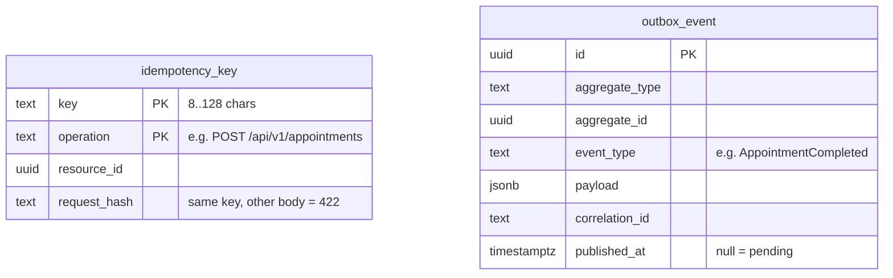

# ERD-01…08 · One Entity-Relationship Diagram per Domain Database

> **Type:** ER · **Derived from:** `06-data/models.md` §1–10 · **Decisions:** ADR-004, ADR-006,
> ADR-010 · **Rule:** norm 7.1–7.4

Each diagram is one database. Lines are real foreign keys **inside** that database. A column
marked `ref <domain>` points to another domain: it is a UUID with **no foreign key**, checked
through that domain's contract (norm 7.4). Every creating domain also owns `idempotency_key`,
and identity-auth, appointment and loyalty own `outbox_event` (§ERD-09); they are not repeated.

## ERD-01 · identity-auth-db (PostgreSQL, schema `identity_auth`)

## ERD-02 · barbershop-db (PostgreSQL, schema `barbershop`)

## ERD-03 · schedule-db (PostgreSQL, schema `schedule`)

No foreign key inside this database: both tables hang from a barber that lives in
barbershop-db. Availability is computed, not stored.

## ERD-04 · appointment-db (PostgreSQL, schema `appointment`)

`ex_appointment_no_double_booking`: an exclusion constraint on `(barber_id, time range)` for
every status except `CANCELLED` and `NO_SHOW` — the database guarantee behind INV-APPT-001.

## ERD-05 · loyalty-db (PostgreSQL, schema `loyalty`)

## ERD-06 · notifications-db (MongoDB rs0, database `notifications`)

Collections, not tables: `delivery_attempt` is an embedded array, not a collection. Validation
is `$jsonSchema` with `additionalProperties: false` (annex B).

## ERD-07 · finance-inventory-db (PostgreSQL, schema `finance_inventory`)

## ERD-08 · platform-admin-db (PostgreSQL, schema `platform_admin`)

platform-admin owns no barbershop rows; it changes them through barbershop-api (OQ-10).

## ERD-09 · Tables every domain repeats

Both are written in the **same transaction** as the resource they belong to (norm 5.3.8,
5.3.11). Their use across services is drawn in [SEQ-02](../uml/seq-book-appointment.md) and
[SEQ-03](../uml/seq-complete-appointment.md).
