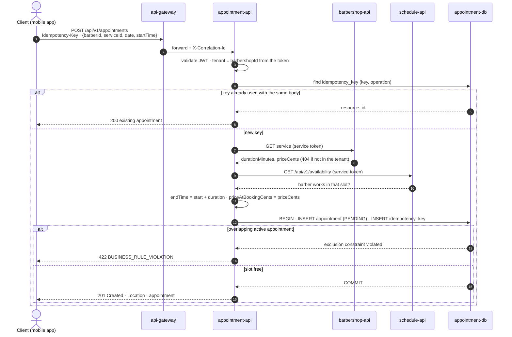

# SEQ-02 · Book an Appointment Without Double-Booking

> **Type:** UML sequence · **Derived from:** `07-api/contracts/openapi/appointment-service.yaml`
> (`bookAppointment`), `06-data/models.md` §5 and §10, `02-domain/entities-and-rules.md`
> (INV-APPT-001/002) · **User story:** HU-APPT-001 (#4)

- The **database is the guarantee** against double booking: `ex_appointment_no_double_booking`
  rejects two active appointments of one barber that overlap in time, even if two requests pass
  the checks at the same instant.
- Outside the barber's schedule also answers `422` (`DEC-APPT-03`); a `barberId` or
  `serviceId` of another tenant answers `404` (`DEC-APPT-01`).
- The price is a snapshot: later changes to the service never touch the appointment
  (INV-APPT-002).
