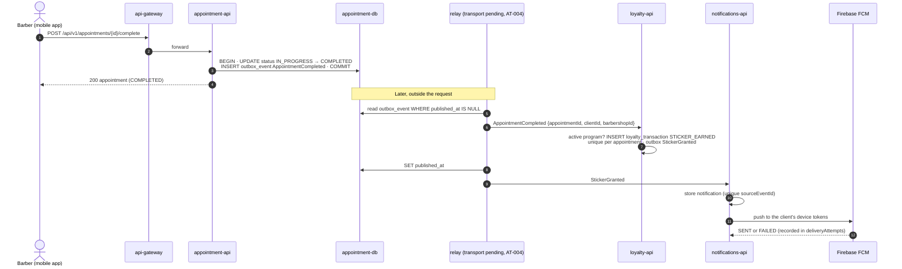

# SEQ-03 · Complete an Appointment (Outbox → Loyalty, Notifications)

> **Type:** UML sequence · **Derived from:** `07-api/contracts/openapi/appointment-service.yaml`
> (`completeAppointment`), `06-data/models.md` §6, §7, §10, `02-domain/domain-events.md`
> (`AppointmentCompleted`, `StickerGranted`) · **Rule:** norm 5.3.11, 7.5

A change in one domain reaching others without a distributed transaction.

- **At-least-once delivery is safe:** a redelivered event hits
  `uq_loyalty_transaction_sticker_per_appointment` or `uq_notification_source_event` and does
  nothing twice.
- A walk-in (`client_id` null) earns no sticker. A barbershop without an active loyalty
  program ignores the event; completing never fails because of loyalty.
- Registering the income in finance-inventory from the same event is the prototype's
  behavior (`registerServiceIncome`); its contract does not declare it yet.
