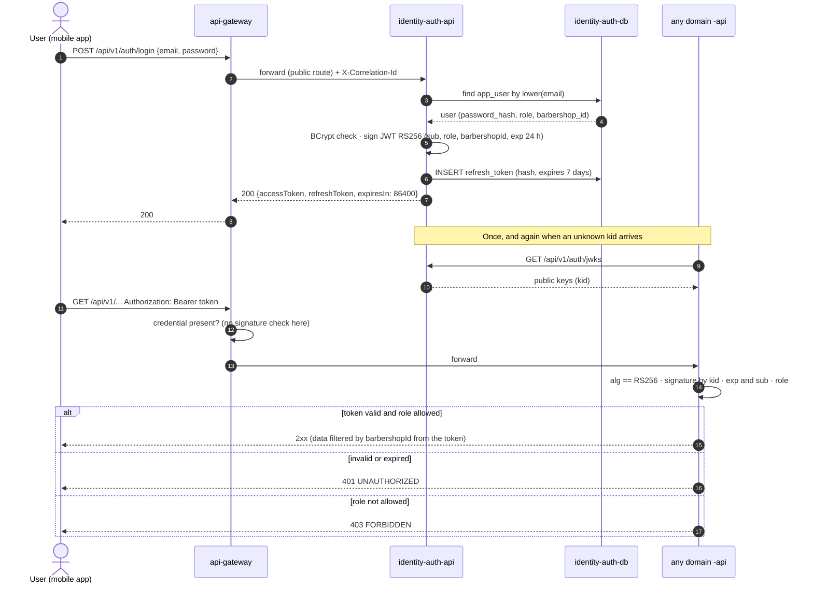

# SEQ-01 · Login and Token Validation

> **Type:** UML sequence · **Derived from:** `07-api/authentication.md`,
> `07-api/contracts/openapi/auth-service.yaml` (`login`, `jwks`) · **Rule:** norm 5.3.7, 5.6.2

How a user gets a token and how any other service trusts it without calling identity-auth on
every request.

Invalid credentials, an inactive account or a temporarily locked one answer `401` without
saying which case applies (`DEC-AUTH-02`). Refresh
(`POST /api/v1/auth/refresh`) rotates both tokens and revokes the old refresh token.
