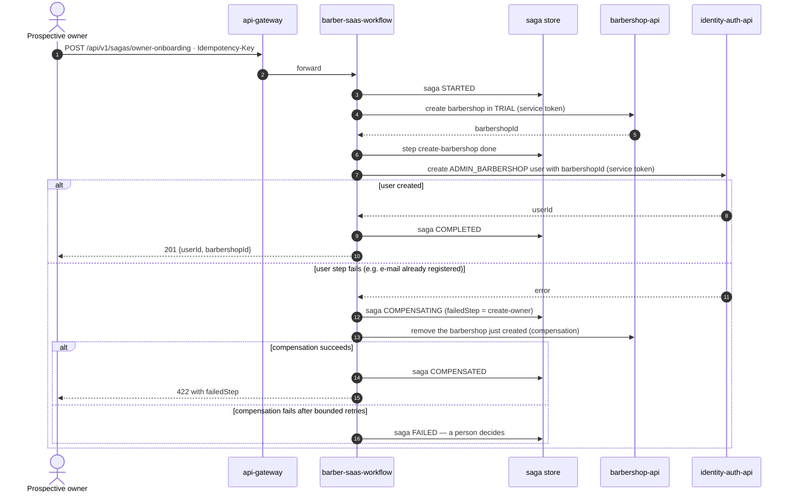

# SEQ-04 · Owner Onboarding Saga (proposed)

> **Type:** UML sequence · **Status:** proposed — closes `07-api/open-questions.md` OQ-12 once
> the team specifies it; saga store per ADR-009 (proposed) · **User story:** HU-AUTH-003 (#7)
> · **Rule:** norm 5.8, annex E

A prospective owner self-registers with a new barbershop in `TRIAL`. The barbershop lives in
`barbershop-db` and the user in `identity-auth-db`, so no single transaction can create both:
the workflow runs it as a saga with a compensation.

- **Order of the steps.** The barbershop goes first because `chk_app_user_tenant`
  (`06-data/models.md` §2) does not allow an `ADMIN_BARBERSHOP` without `barbershop_id`.
  OQ-12 describes the opposite order (user first, "deactivate the user" as compensation); that
  wording has to be aligned when the saga is specified. The compensation removes the barbershop
  rather than cancelling it: `TRIAL → CANCELLED` is not a transition of [ST-02](state-barbershop.md).
- State is written to the saga store **after every step and every compensation**, so the
  workflow resumes or compensates after a restart (annex E).
- The internal operations this saga calls (create barbershop and owner with a service token,
  remove barbershop) are not yet declared in `barbershop-service.yaml` / `auth-service.yaml`.
- The business process view of this saga belongs in `16-bpmn` (not created yet).
