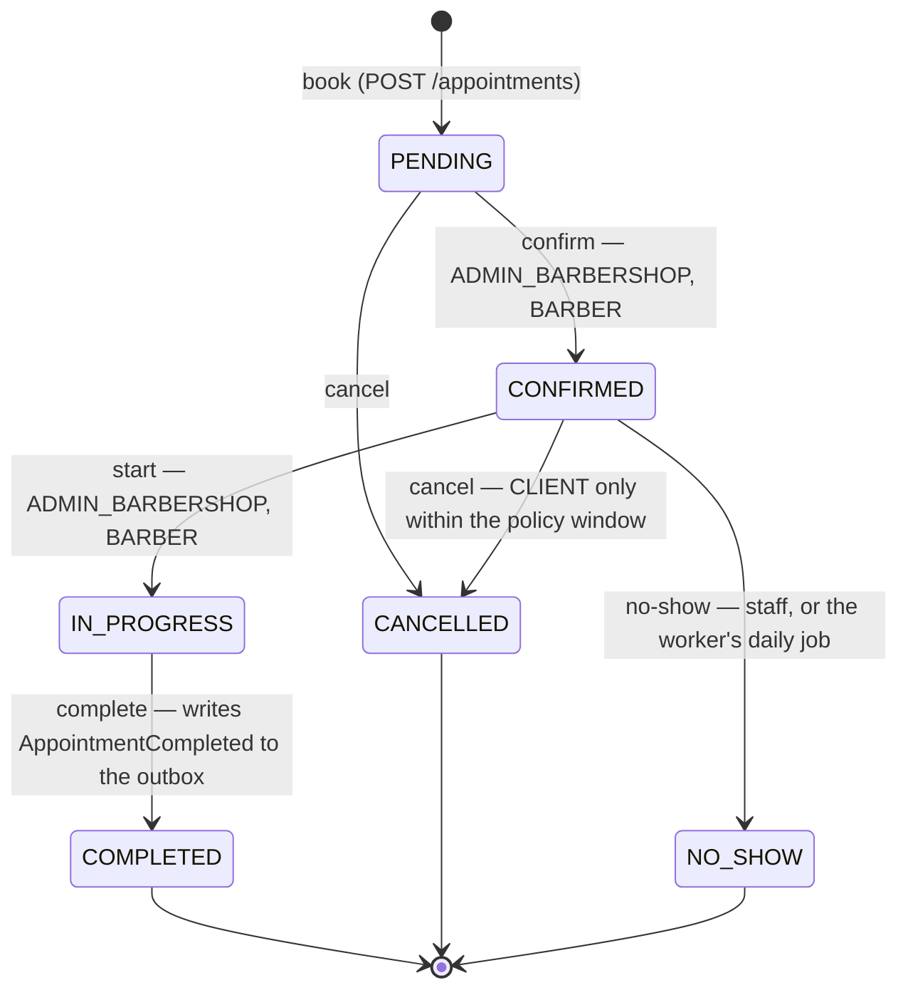

# ST-01 · Appointment Lifecycle

> **Type:** UML state machine · **Derived from:** `02-domain/entities-and-rules.md`
> (Appointment, INV-APPT-004), `07-api/contracts/openapi/appointment-service.yaml`,
> `06-data/models.md` §5 (`chk_appointment_status`)

| Rule | Effect on the diagram |
|---|---|
| INV-APPT-004 | Any transition not drawn answers `422 INVALID_STATUS_TRANSITION` |
| INV-APPT-003 | A `CLIENT` cancels only while more than `cancellation_policy_hours` remain before the start |
| INV-APPT-001 | `CANCELLED` and `NO_SHOW` free the slot: the no-double-booking constraint ignores them |
| Terminal states | `COMPLETED`, `CANCELLED`, `NO_SHOW` never change again |
