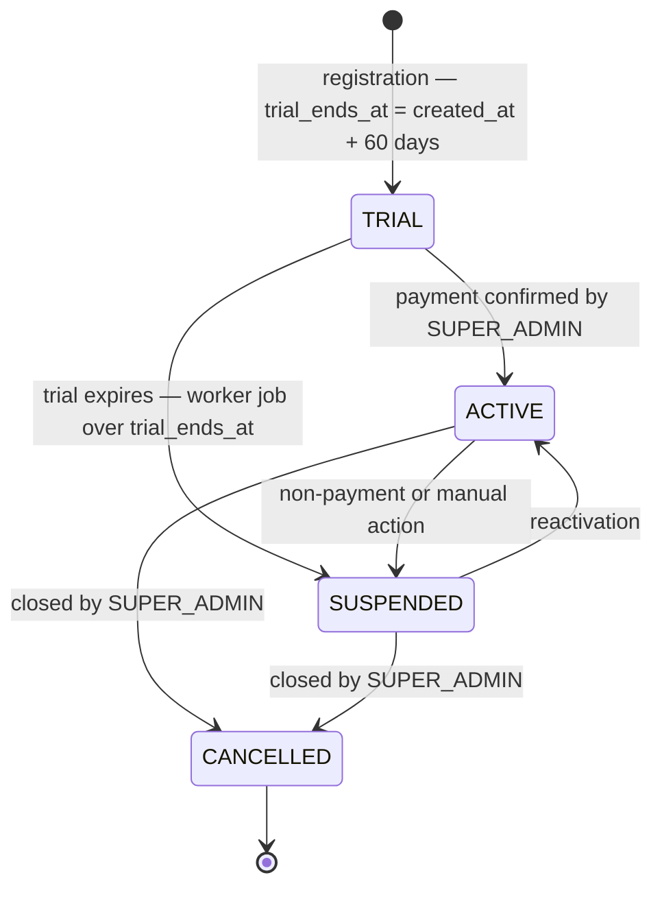

# ST-02 · Barbershop Subscription Lifecycle

> **Type:** UML state machine · **Derived from:** `02-domain/entities-and-rules.md`
> (Barbershop, INV-SHOP-001/002), `06-data/models.md` §3 (`chk_barbershop_status`)

| Rule | Effect on the diagram |
|---|---|
| INV-SHOP-001 | `trial_ends_at` is set once on entering `TRIAL` and never recalculated |
| INV-SHOP-002 | Every transition is triggered by `SUPER_ADMIN` (through platform-admin-api) or by the worker with a service token — never by the barbershop's own users |
| OQ-10 | platform-admin changes the status through barbershop-api; it never writes `barbershop-db` |
