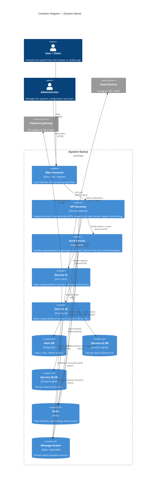

# Example: C4 Container-Level Diagram

> **Framework example.** BarberSaaS's real container diagram is in
> `05-architecture/overview.md` §3 (8 domain services behind the api-gateway, one database per
> domain).

> This file shows how to document the system with a C4 Level 2 (Container) diagram.
> The diagram uses Mermaid, which renders natively on GitHub, GitLab and most modern editors
> (VS Code with an extension, Obsidian, etc.).
>
> **Instruction:** Copy this structure, replace the example services (api-gateway,
> auth-service) with your project's real services, and move it to `diagrams/source/c4-container.md`.

---

## Example system: [X] management platform



---

## How to use this diagram

1. **Render on GitHub:** The diagram renders automatically on push. No extra tool is needed.

2. **Render in VS Code:** Install the "Markdown Preview Mermaid Support" extension or use the official Mermaid extension.

3. **Export as an image:** Use the [Mermaid CLI](https://github.com/mermaid-js/mermaid-cli):
```bash
mmdc -i c4-container-example.md -o ../exports/c4-container.svg
```

4. **Update the diagram:** The diagram lives in Git next to the code. When the architecture changes (new service, new DB engine), update the diagram in the same PR.

---

## Conventions for this project

| Element | Color / Style | When to use it |
|---------|---------------|----------------|
| `Container` | Blue | Microservice or deployable application |
| `ContainerDb` | Blue cylinder | Database, cache, broker |
| `Person` | Person icon | Human actor |
| `System_Ext` | Gray | Third-party system you do not control |

---

## Correlations

- Service catalog → `09-microservices/service-catalog.md`
- Details of each service → `09-microservices/services/`
- Index of every diagram → `08-uml/diagram-index.md`
